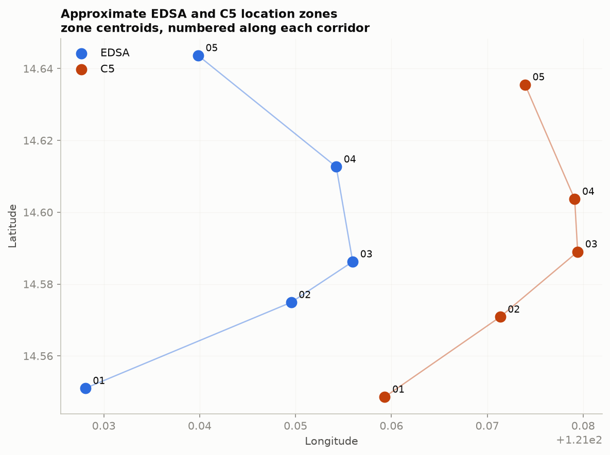

# MMDA Traffic Crash Simulator: User Manual

Explore how higher traffic volume could change **MMDA-reported crashes on EDSA and C5**, and examine when and where those reports fall. This guide walks through every website feature, explains how to interpret the results, and provides experiments to try.

**PDF edition:** [MANUAL.pdf](MANUAL.pdf)  
**Project:** [D3vala/traffic_model](https://github.com/D3vala/traffic_model)  
**Prepared by:** Group 9 - AM3: BACALLA, M.D.P.; CASTILLO, C.R.M.; CUEVA, X.L.A  
**Manual version:** 5 October 2026; checked against the simulation run dated 2026-10-05. This version has six zones per highway, 1,000 count-model runs per scenario, and 1,000 event-model runs for each scenario and assumption.

## Contents

1. [Start here](#1-start-here)
2. [Take a five-minute tour](#2-take-a-five-minute-tour)
3. [Change traffic volume](#3-change-traffic-volume)
4. [Try the traffic-response assumptions](#4-try-the-traffic-response-assumptions)
5. [Read annual results and range plots](#5-read-annual-results-and-range-plots)
6. [Explore the hourly chart and playback](#6-explore-the-hourly-chart-and-playback)
7. [Read the highway-zone map](#7-read-the-highway-zone-map)
8. [Try three guided experiments](#8-try-three-guided-experiments)
9. [Save, share, and reset a view](#9-save-share-and-reset-a-view)
10. [Use mobile and keyboard controls](#10-use-mobile-and-keyboard-controls)
11. [Understand the evidence and limitations](#11-understand-the-evidence-and-limitations)
12. [Troubleshoot common problems](#12-troubleshoot-common-problems)
13. [Glossary](#13-glossary)
14. [Maintainer reference](#14-maintainer-reference)

## 1. Start here

The website is a viewer for a completed simulation. A control selects previously computed results; it does not collect live traffic data or run a new simulation in your browser. No account, login, or file upload is needed.

### Open the website

- **Hosted version:** open the published website link supplied by the project team. Viewing `app/index.html` as a file on GitHub shows its source; it does not run the website.
- **Local version:** download or clone the complete project, extract it if necessary, and double-click `app/index.html`. Keep `app.js`, `styles.css`, and `app/data/` beside that file in their original layout. No server or build step is needed.
- **Offline use:** the local version reads its bundled results without internet access. Google Fonts may fail to load offline, so fallback fonts are used. A hosted page needs a connection to load initially.

A fresh opening without saved settings starts at **Today**, **in step**, and **All day**. A saved link instead restores its traffic scenario, assumption, and selected hour.

### What the page contains

| Page area | What to do there |
| --- | --- |
| Top road animation and traffic buttons | Choose Today, +10%, +20%, or +30%; read the daily vehicle totals. |
| Reported crashes in one year | Compare annual averages, simulation ranges, changes from baseline, and rates. |
| When and where they happen | Select an hour, play through the day, and inspect highway zones. |
| How far to trust this | Read limitations and expand the validation and model explanations. |
| Footer and floating traffic bar | Copy the current view's link; check the run date and simulation details. |

EDSA uses **blue** and C5 uses **orange**. Read road labels as well as colors. On narrow screens, sections stack vertically: scroll to find both the hourly chart and map rather than relying on left/right positions.

## 2. Take a five-minute tour

1. Select **Today** at the top and **in step** above the annual panels. Read each road's average and the sentence beneath its range plot.
2. Select **+20%**. Watch the road become busier and compare the new averages with the Today reference marks. Daily vehicle totals also increase.
3. Keep +20% selected and try **more slowly**, **in step**, then **faster**. The assumed crash response changes while traffic volume stays the same.
4. Scroll to **When and where they happen**. Select **7 AM** on the hourly chart, then **3 PM**. Confirm each choice using the selected-time label and watch the map circles change.
5. Select **Play**, watch several hours, and select **Pause** to inspect one. Select **All day** to return the map to its neutral overview.
6. Open **How far to trust this**. Expand the checks summary and **How the simulation works**.
7. Choose a view to keep, pause playback, and select **Copy link** in the footer or floating bar.

To return to the starting view, select **Today**, **in step**, and **All day**. Changing one control does not reset the others.

## 3. Change traffic volume

Use the four buttons below the animated road, or drag its yellow slider to one of the four stops. On a touch screen, tap a button or drag the slider with your finger.

| Traffic choice | Meaning | EDSA vehicles/day | C5 vehicles/day |
| --- | --- | ---: | ---: |
| Today | The model's 2025 baseline traffic volume | 421,728 | 225,885 |
| +10% | 10% more traffic than the baseline | 463,901 | 248,474 |
| +20% | 20% more traffic than the baseline | 506,074 | 271,062 |
| +30% | 30% more traffic than the baseline | 548,246 | 293,651 |

Daily totals are rounded. **Today means the model's 2025 baseline**, not live traffic on the date you visit. The higher-volume choices are what-if scenarios, not forecasts.

The selected button has a yellow underline, the slider label updates, and the annual panels, hourly counts, and selected-hour map update together. Your assumption and hour selections stay in place.

The animated stream becomes denser at higher settings. Its car count and constant movement are illustrative, not measurements of road capacity, congestion, travel speed, or vehicle locations. Cars leaving the edge are part of a looping illustration.

After you scroll beyond the road, a compact traffic bar appears at the top. It controls the same scenario, allowing changes without scrolling back. Road animation pauses when offscreen or the browser tab is hidden; your settings are retained.

## 4. Try the traffic-response assumptions

Above the annual panels, select **more slowly**, **in step**, or **faster** to explore how strongly crashes might respond to higher traffic. Select **?** for the explanation. Select it again, click outside it, or press Escape to close it.

| Choice | Elasticity | Interpretation |
| --- | ---: | --- |
| more slowly | 0.8 | Crashes grow more slowly than traffic. |
| in step | 1.0 | Crashes grow proportionally with traffic. |
| faster | 1.2 | Crashes grow faster than traffic. |

The model multiplies the expected count by `(1 + traffic increase)^elasticity`. Before simulation noise, +20% traffic implies approximately **15.7%**, **20.0%**, or **24.5%** more crashes under the three assumptions. Displayed means may differ slightly because the simulation contains random variation.

**Try this:** hold traffic at +20% and switch between all three choices. Compare each road with its own Today reference. These are alternative assumptions, not measurements establishing the true relationship. At Today, there is no traffic increase to amplify, so differences among assumptions may be small or reflect simulation noise.

This selector updates annual counts and rates, hourly counts, and selected-hour zone counts. It does not change traffic volume, move zones, or discover new peak hours: historical hourly shares and zone-by-hour patterns remain fixed.

## 5. Read annual results and range plots

Each road has a panel under **Reported crashes in one year**. Read the average, range, baseline difference, and rate together.

### The large number and uncertainty band

The large number is the **mean reported-crash count across 1,000 simulated years** for that road, scenario, and assumption. It is a modeled annual result, not an observed count for the current calendar year.

The colored band spans the **5th to 95th percentile**, enclosing the middle 90% of simulated annual outcomes. The colored vertical tick marks the mean. The thinner mark labeled **Today** is that road's baseline mean under the same assumption. The sentence below translates the band: "In 9 of 10 simulated years..."

About 10% of simulated outcomes lie outside the band. This is a simulation interval, not a guarantee; it does not cover every possible error in the data or assumptions. A wider band indicates more spread in modeled outcomes.

Each road's range-plot scale stays fixed when settings change, making comparisons within that road easier. **EDSA and C5 have different plot scales**: compare numeric labels rather than distances or band widths across their panels.

### Difference from Today and rate

**More than today** is the selected mean minus the baseline mean for the current assumption, rounded for display. At Today, the panel says **This is today's level**. A one-count discrepancy between rounded headlines and the displayed difference can occur because the difference is calculated before rounding.

**Per 100,000 vehicle passages** relates crashes to modeled traffic exposure. One passage represents a vehicle passing through a corridor; the same vehicle can contribute multiple passages. The rate is not a probability that a particular driver will crash. Use it alongside counts to compare roads with different traffic volumes, while recognizing that reporting differences remain.

Headlines come from the count simulation (Step 6); rates come from the separate event simulation (Step 8). Dividing a rounded headline by exposure may therefore not reproduce the displayed rate exactly. At elasticity 1.0, the current run's largest difference between the simulations is 1.9%.

### Check your starting view

These figures apply to **Today + in step** in the 5 October 2026 bundle. A newer regenerated bundle may change them.

| Road | Annual mean | Middle 90% of simulated years | Rate per 100,000 passages |
| --- | ---: | --- | ---: |
| EDSA | 3,376 | 2,559 to 4,427 | 2.18 |
| C5 | 1,334 | 836 to 2,018 | 1.64 |

EDSA's larger count alone does not establish that an individual journey there is more dangerous. EDSA carries more traffic and the feed reports the roads differently. The rate improves the exposure comparison but does not eliminate reporting bias.

## 6. Explore the hourly chart and playback

The line chart in **When and where they happen** distributes expected annual crashes across 24 hours of the day. Its vertical axis is **reported crashes a year in that hour**. A value of 261 at 7 AM means roughly 261 crashes assigned to 7:00-7:59 AM across the entire simulated year, not 261 in one morning.

Blue represents EDSA; orange represents C5. Filled dots identify each road's four busiest hours, and callouts mark the peaks. In this bundle, EDSA peaks at **7 AM** and C5 at **3 PM**. Under Today + in step, peak-hour counts are about **261** and **143** per year. The four busiest hours hold 28.6% of EDSA reports and 35.1% of C5 reports.

### Select an hour

1. Click or tap near an hour on the chart, or drag across it to move through consecutive hours.
2. Read **Showing ...** beneath it to confirm the exact hour.
3. Watch the vertical cursor and map update. Annual headlines remain annual totals when you choose an hour.

The line chart still displays the full day; choosing an hour highlights it and drives the map rather than filtering the line down to one point. Its vertical scale may change when traffic or the assumption changes: compare axis numbers and callouts rather than line height alone. Overnight estimates rest on few reports, so read them cautiously.

### Play, Pause, and All day

- **Play** advances one hour about every 0.65 seconds. It begins at midnight from All day, or advances from the selected hour. After 11 PM, it loops to midnight. This replays the modeled distribution; it is not live traffic or a newly sampled day.
- **Pause** stops at the current hour for inspection. Selecting or dragging to an hour also stops playback. Switching to another browser tab stops active playback.
- **All day** stops playback, removes the hour cursor, and gives map circles neutral sizes. Traffic and assumption settings stay unchanged.

Small screens show fewer time-axis labels, but every hour remains selectable. The far-right label denotes the midnight boundary; the final selectable slot is **11 PM (23:00)**. Use the selected-time label to identify the slot.

## 7. Read the highway-zone map

There are **six zones for EDSA and six for C5: 12 total**. Each road has its own Zone 1 through Zone 6. Zone 1 is toward the south and Zone 6 toward the north. EDSA Zone 3 and C5 Zone 3 are different places.

Lines connect centroids derived from historical GPS reports. This is a **schematic map**, not a street basemap, route planner, or exact drawing of highway geometry. Zones are analytical groups, not official boundaries, equal-length segments, or named interchanges. Reports were grouped along each corridor to give zones roughly equal shares of historical reports.

### Inspect a zone

1. Select an hour on the line chart, or select Play and then Pause.
2. Hover over a circle with a mouse, or use Tab to focus it. Its tooltip identifies the highway, zone, selected hour, and approximate annual count for that zone-hour combination.
3. Compare circles at the same hour. Larger circles indicate more expected reports. Use tooltip values for numerical comparisons; circle size is a visual cue, not a scale to measure with a ruler.
4. Choose a different hour and observe the distribution change. Always pair a zone number with its highway name.

**All day** intentionally uses equal, neutral circle sizes. Because zones hold roughly equal historical report shares, this is not an all-day hotspot ranking. Choose an hour to see differences between zones.

A larger circle does not establish higher crash risk per vehicle: the model lacks zone-by-hour traffic exposure. Changing traffic or the assumption changes counts, not zone locations or the number of zones.

The figure below shows the current notebook's zone centroids. It is a reference illustration, not a website screenshot. The website's circle sizes change as you select hours.



## 8. Try three guided experiments

### Experiment A: Isolate the effect of traffic

1. Select **Today**, **in step**, and **All day**.
2. Record each mean, interval endpoints, and rate.
3. Select **+10%**, **+20%**, and **+30%** in turn, keeping the assumption unchanged.
4. Compare each road's mean with its Today reference and read the displayed increase.

In this run, EDSA's in-step annual means are approximately **3,376 / 3,778 / 4,061 / 4,411** across the four choices. C5's are **1,334 / 1,470 / 1,633 / 1,766**. Counts rise; rates stay broadly similar under a proportional response. Exact percentage increases can vary from the traffic increases because of simulation noise.

### Experiment B: Test an assumption

1. Keep traffic at **+20%**.
2. Select **more slowly**, **in step**, and **faster**.
3. Record means and intervals, comparing each with its own assumption's Today reference.
4. Select **?** to review why the relationship is uncertain.

This asks how much your conclusion depends on the assumed response. A suitable conclusion is: "Under +20% traffic, the expected increase depends on the elasticity assumption." Selecting one option does not make it a verified forecast.

### Experiment C: Compare morning and afternoon zones

1. Choose **Today + in step** and select **7 AM**.
2. Inspect several circles and record highway, zone, and count.
3. Select **3 PM** and inspect the same zones.
4. Play through the day, pause at another hour, and inspect the redistribution.
5. Return to All day and observe the neutral circles.

This compares modeled report patterns across time, not driving danger. Small zone-hour values may reflect sparse historical evidence.

When taking notes, record: **run date | traffic setting | assumption | hour or All day | highway | mean and range | rate | zone and tooltip value, if relevant**. Keeping these details together makes comparisons reproducible.

## 9. Save, share, and reset a view

Select **Copy link** in the floating bar or footer. **Link copied** briefly confirms success. Paste the link into your notes or a message. If **Copy failed** appears, copy the browser address manually.

The address fragment stores three settings:

```text
index.html#s=20&e=1.0&h=7
```

| Setting | Meaning in the example | Supported values |
| --- | --- | --- |
| s | +20% traffic | 0, 10, 20, 30 |
| e | in step | 0.8, 1.0, 1.2 |
| h | 7 AM | 0 to 23; omitted for All day |

Opening or reloading the link restores those settings. Playback, open explanations, and hover tooltips are not saved. A link does not freeze the dataset: record the footer run date to identify the results used.

Share a **hosted website URL** with other people. A local `file://` address points to your computer and is not portable; recipients would need their own project copy. You can bookmark a hosted link in your browser.

There is no single reset button. Select Today, in step, and All day. Alternatively, remove the settings after `#` and reload. Merely editing the fragment without reloading is not the documented restore method. Browser Back is not a step-by-step undo history for these controls.

## 10. Use mobile and keyboard controls

On mobile, tap traffic and assumption buttons and tap or drag the hourly chart. Scroll to the map and trust section. The compact traffic bar keeps scenario buttons available after the hero scrolls away. Zone tooltips support mouse hover and keyboard focus; touch-only access depends on the browser's focus behavior.

| Control | Keyboard action |
| --- | --- |
| Move between controls | Tab; Shift+Tab to move back |
| Activate buttons or expandable summaries | Enter or Space |
| Traffic slider | Arrow keys while focused |
| Assumption group | Arrow keys move between and select assumptions |
| Hourly chart | Left/Down: previous hour; Right/Up: next hour |
| Hourly chart shortcuts | Home: midnight; End: 11 PM; Page Up/Down: move six hours |
| Zone circles | Tab to reveal the description; move focus away to dismiss |
| Assumption explanation | Escape closes it and returns focus to ? |

Hour shortcuts stop at midnight or 11 PM; automatic playback wraps. From All day, keyboard hour navigation starts from the midnight reference.

The site includes chart descriptions, accessible data tables, selected-state labels, visible focus indicators, and selected-hour announcements. The tables are visually hidden chart equivalents, not a visible spreadsheet-download feature.

With reduced motion requested by your system or browser, cars are stationary but their visible count still reflects traffic, and numeric transitions are minimized. Play remains an explicit user control. Switching tabs stops playback; return and select Play to resume when desired.

## 11. Understand the evidence and limitations

Use **About the data** at the top to jump to **How far to trust this**, or scroll there. Read its limitations before using results in a report.

- **Reported crashes:** the source is MMDA's social-media feed. Missing posts do not establish that no crash happened. A lower count need not mean greater safety.
- **Study window:** estimation uses 18 complete months, September 2018 to February 2020. Lockdown disruption and later collection gaps are excluded.
- **Frozen trend:** trends are held at the end of that window. Applying a 2025 traffic baseline does not demonstrate that old trends forecast current conditions.
- **Assumed response:** the data cannot identify true elasticity. The three choices show sensitivity to this uncertainty.
- **Approximate zones:** they describe where reports fell. No zone-hour exposure denominator is available to calculate individual driving risk.

Expand the **checks passed** summary to read the validation categories. Expand **How the simulation works** for the modeling sequence. The current bundle reports **34 of 34 main checks passed**, and a **1.9% maximum difference** between count and event simulations at elasticity 1.0. Passing checks establishes internal consistency under the assumptions, not guaranteed prediction of future outcomes.

Held-out errors shown on the page are about **16% for EDSA** and **32% for C5**, using November 2019 to February 2020. This is a small historical test, not an accuracy guarantee for 2025 or later years.

The footer gives the **run date, 1,000 runs per scenario, random seed, and data sources**. A fixed seed supports reproducibility with the same inputs and analysis. The notebook and regenerated results are the numerical source of truth; the website presents them.

There are no website controls to upload replacement data, rerun the notebook, change zone counts, display vehicle speeds, calculate travel times, plan routes, or download chart CSVs. Underlying files are described in the maintainer reference.

## 12. Troubleshoot common problems

| What you see | What to try or check |
| --- | --- |
| "This page needs JavaScript" | Enable JavaScript in the browser, then reload. |
| "The simulation data didn't load" | Keep the full app folder together. Confirm `app/data/app-data.js` exists, then reload. |
| HTML source text on GitHub | Open the team's published URL, or download/extract the project and open its local HTML file. |
| Cars have stopped moving | Check reduced motion, whether the road is offscreen, and whether the tab was hidden. Results remain available. |
| Equal map circles | All day intentionally uses neutral circles. Select an hour. |
| Annual headlines stay unchanged when selecting an hour | Expected: headlines remain annual. The hour changes the map and cursor. |
| Tooltip difficult to access on a phone | Use a mouse or keyboard focus when available; touch focus varies between browsers. |
| Crash increase differs from 10%, 20%, or 30% | Check the elasticity and allow for simulation noise and rounding. |
| Copy link fails | Copy the address manually. Share a hosted address, not a path to your computer. |
| Offline fonts look different | Fallback fonts are expected; bundled data and controls still work. |
| Old results or five zones after a notebook update | The maintainer must rerun, export, verify, and deploy. Reload afterward; a hard refresh may clear cached files. |

For an issue report, give the run date, browser/device, the three selected settings, steps taken, and exact error text. A screenshot can help the project team locate the affected control.

## 13. Glossary

| Term | Meaning in this website |
| --- | --- |
| AADT | Annual Average Daily Traffic: average daily vehicle volume representing traffic exposure. |
| Baseline / Today | The 2025 traffic reference before a percentage increase. |
| Corridor | EDSA or C5, the two highways represented. |
| Elasticity | Assumed strength of the crash-count response to traffic growth. |
| Exposure / passages | Modeled traffic volume over time, used as a rate denominator. |
| Mean | Average annual count across simulated years. |
| 5th / 95th percentiles | Endpoints enclosing the middle 90% of simulated annual outcomes. |
| Monte Carlo simulation | Repeated random draws exploring possible outcomes under a model. |
| Negative Binomial model | A count model allowing more variation than a simple Poisson model. |
| Zone centroid | Average historical GPS position placing a circle on the map. |
| Zone-hour count | Expected reports in a zone and hour-of-day slot across a simulated year. |

## 14. Maintainer reference

Ordinary website use does not require the tools in this section.

### Project files

| File or folder | Purpose |
| --- | --- |
| `MMDA_Traffic_Simulation.ipynb` | Source notebook: analysis settings and logic. |
| `MMDA_Traffic_Simulation_executed.ipynb` | Completed run with outputs and checks. |
| `data/` | Four source CSVs; read-only during an analysis run. |
| `results/` | Generated processed data, tables, figures, and logs. |
| `app/index.html`, `app/styles.css`, `app/app.js` | Website structure, styling, and controls. |
| `app/data/app-data.js`, `app/data/app-data.json` | Webpage data bundle and its JSON reference copy. |
| `scripts/export_app_data.py` | Exports results, zone profiles, rates, and run metadata. |
| `scripts/check_app_data.js` | Checks sums, reconciliation, zones, and event rates/run counts. |
| `scripts/build_manual.py` | Builds MANUAL.pdf from the README using ReportLab. |
| `NOTES.md` | Assumptions, decisions, and verification history. |
| `README.md`, `MANUAL.pdf` | This guide and its PDF edition. |

The incident file covers August 2018 to December 2020; estimation uses only the complete 18-month window. Other sources include NCTS/MMDA traffic counts, PSA road-crash statistics, and MMDA EDSA violation records. Listing a source does not imply a causal effect has been estimated from every dataset.

### Regenerate after a notebook change

Editing a notebook does **not** automatically update the website. Run these commands from the project root:

```sh
python -m nbconvert --to notebook --execute MMDA_Traffic_Simulation.ipynb --output MMDA_Traffic_Simulation_executed.ipynb
python scripts/export_app_data.py
node scripts/check_app_data.js
```

The notebook rebuilds results and runs validation. The exporter reads the configured zone and event-run counts, exports the full hourly profile, and checks generated tables. The independent checker verifies reconciliation and bundle structure. Review desktop and narrow-screen layouts after interface or map changes.

The analysis needs Python with Jupyter/nbconvert, an IPython kernel, pandas, numpy, scipy, statsmodels, and matplotlib. Node is needed for verification. These tools are not required to open the static website.

The exporter expects the four scenarios and three assumptions documented here. Changing these dimensions or result formats can require exporter, checker, and interface changes. Notebook prose is not automatically copied into website explanations or this manual.

### Publish updates

Commit and push the source and executed notebooks, generated results, and updated app files. The existing `.github/workflows/static.yml` deploys **app/** to GitHub Pages on pushes to **main** when Pages is configured for GitHub Actions. Check deployment completes before asking visitors to refresh.

For another static host, publish **app/** with relative paths intact; no build command is needed. The workflow publishes only app/, so the root README and PDF are repository documentation, not automatically published website pages.

### Keep this guide accurate

Review the run date, numerical examples, zones, rates, controls, and interpretations whenever the data or interface changes. The root screenshots (`screenshot-1366x768.png`, `screenshot-375.png`, `screenshot-320.png`) are earlier layout references and predate six zones. Use current source and data to check behavior. Regenerate the PDF after editing this README so both editions remain aligned.

To rebuild the PDF, use Python with the `reportlab` package and run:

```sh
python scripts/build_manual.py
```

The builder reads this README and writes `MANUAL.pdf` at the project root, including the contents page, bookmarks, and zone illustration. Review the rendered PDF before publishing. Long commands may wrap visually in the PDF; use the original single-line commands in the README when copying them to a terminal.
